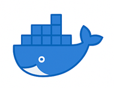

    

<!-- ## 👋 Hi, i'm Someshwar Sangaraju -->
<h1 style="font-size: 48px;">👋 Hi, i'm Someshwar Sangaraju</h1>

<!-- 
<strong>DEVOPS ENGINEER</strong>
 -->

  🚀 DevOps • Cloud Engineer | 
  AWS | 
  CI/CD | Kubernetes | Terraform | Docker

<!-- LinkedIn logo only -->

<!-- Gmail with full email -->

<!-- # 💫 About Me: -->

I’m a passionate <strong>DEVOPS ENGINEER</strong> with over 3+ years of experience in building scalable, secure, and highly available cloud platforms. I specialize in automating infrastructure, enabling CI/CD at scale, and ensuring reliability with AWS
<!-- 🚀 DevOps professional with 3+ Years of Cloud Experience I work with AWS DevOps. I build and manage cloud infrastructure to make software delivery faster and more reliable. I use DevOps tools to help projects run smoothly, scale well, and stay secure. I create CI/CD pipelines, automate deployments, and manage containers with Docker and Kubernetes. I aim to reduce downtime and improve development speed. I use Terraform to set up cloud resources like VMs, App Services, EC2, S3, and Load Balancers. I also monitor performance with tools like Prometheus, keeping applications running efficiently. I write scripts using Shell, Bash, and python to automate tasks, troubleshoot issues, and maintain 24/7 service availability. I follow best practices to keep cloud environments safe and efficient. Skills: Cloud Platforms: AWS, Azure Infrastructure as Code: Terraform, ARM Templates CI/CD Tools: Jenkins Containerization: Docker, Kubernetes Monitoring Tools: Azure Monitor, CloudWatch, Prometheus Scripting: Shell, Bash, PowerShell Networking: VPCs, Load Balancers, Security Groups Databases: RDS, SQL. Security: IAM, RBAC, Key Vault Deployment: Azure App Services, EC2, VMs. 🌟 Let’s work together to bring success to your cloud projects! -->

<!-- 
 -->

<!-- ## 🌐 Socials:
   -->

<h2> 🧰 Tech Stack</h2>

<ul style="font-size: 26px;">

  <li><strong>Cloud:</strong> AWS Cloud</li>
  <li><strong>OS:</strong> Linux, Windows</li>
  <li><strong>CI/CD:</strong> GitHub Actions, Jenkins</li>
  <li><strong>SCM:</strong> GitHub, Bitbucket</li>
  <li><strong>IaC:</strong> Terraform </li>
  <li><strong>Containers:</strong> Docker, Kubernetes</li>
  <li><strong>Security &amp; Scanning:</strong> SonarQube, Snyk</li>
  <li><strong>Artifactory:</strong> Nexus, JFrog</li>
  <li><strong>Scripting:</strong> Bash, Shell, Python</li>
  <li><strong>Monitoring:</strong> Splunk, Prometheus, Grafana, CloudWatch</li>

</ul>

<!-- What I Do -->
<h2>🛠️ What I Do</h2>

<ul style="font-size: 26px;">

  <li>🛠 Build and manage infrastructure on <strong>AWS</strong> using <strong>Terraform</strong> for repeatable, secure provisioning</li>

  <li>🚀 Design high-performance <strong>CI/CD pipelines</strong> using <strong>Aws DevOps, GitHub Actions, Jenkins,</strong> and <strong>Jules</strong>, reducing delivery friction</li>

  <li>📝 Manage codebases and collaboration with <strong>GitHub</strong> and <strong>Bitbucket</strong>, ensuring streamlined source control and peer workflows</li>

  <li>🤖 Automate infrastructure and operational tasks using <strong>Linux, Shell scripting,</strong> and <strong>Python</strong>, improving consistency and speed</li>

  <li>🧪 Enforce quality with <strong>SonarQube</strong>, and manage artifacts with <strong>Nexus</strong> and <strong>JFrog Artifactory</strong></li>

  <li>🔐 Secure cloud environments using <strong>IAM, RBAC</strong>, ensuring compliance and access control</li>

  <li>📊 Ensure observability and performance with <strong>Splunk, Prometheus,</strong> minimizing downtime</li>

</ul>

  <h2>💼 Career Snapshot</h2>

  

    <h3>🏢 Wipro  – Project Engineer</h3>
    

      Designed secure cloud infrastructure using AWS.
      Built CI/CD pipelines, implemented Infrastructure as Code (IaC), 
      and improved uptime and operational efficiency.
    

  

  <!-- 

    <h3>🏢 Avineon – GIS Engineer</h3>
    

      Developed spatial mapping solutions using AutoCAD. Delivered 24/7 system monitoring 
      and ensured data accuracy and map validation integrity.
    

  
 -->

<!DOCTYPE html>
<html lang="en">
<body>
    <section class="section">
        <h2 class="section-title">💠 Skills Showcase</h2>
        

            
            
            
            
            
            
            
            
            
            
        

    </section>
</body>
</html>

# 📊 GitHub Stats:

  

<!--   -->

---

<!-- Proudly created with GPRM ( https://gprm.itsvg.in ) -->
